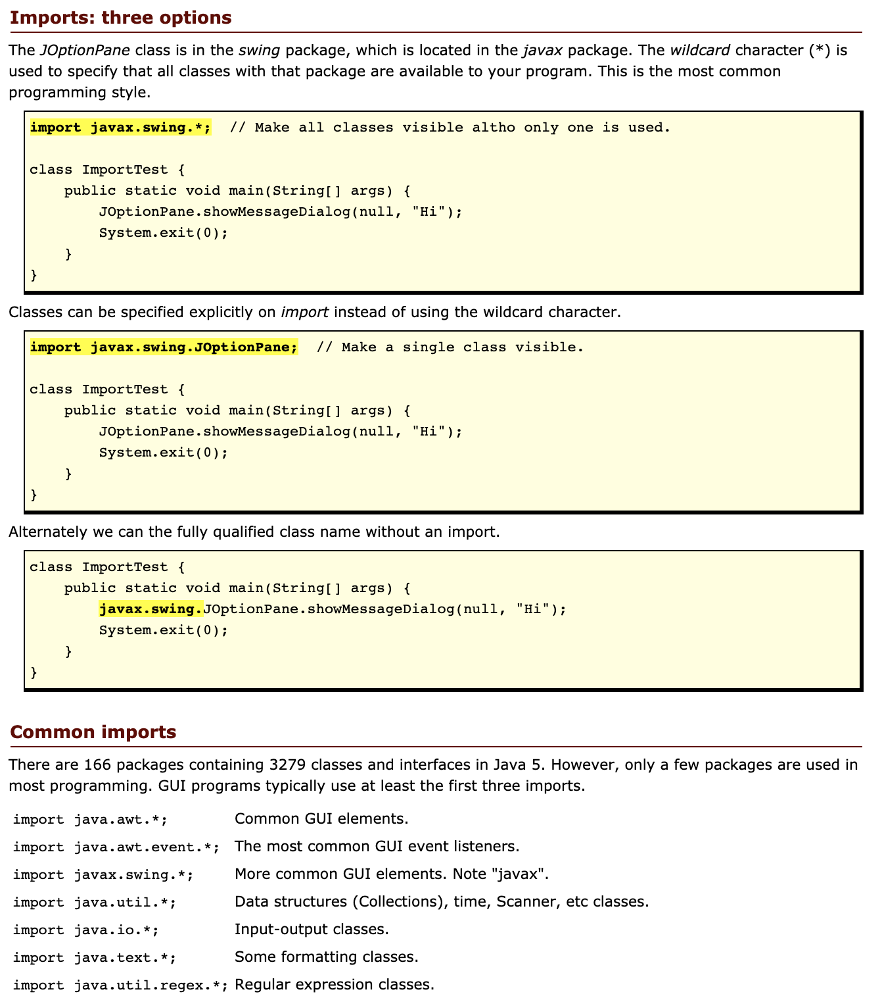

# Arrays, Loops, Imports

## [Java Imports](https://perso.ensta-paris.fr/~diam/java/online/notes-java/language/10basics/import.html)

- Package is a directory
  - package name should be the same name as the directory/folder that contains `.java` files
  - `package directoryName`
- Using from other libraries? use an `import` statement
  - `import java.util.someLibrary`

### Multiple ways of importing and using a package and common imports

- Using the wildcard(*) character when importing is normal and does not make the code any less efficient or larger

## [Different types of loops in Java](https://www.baeldung.com/java-loops)

- *"looping is a feature which facilitates the execution of a set of instructions until the controlling Boolean-expression evaluates to false."*

### for

- Typically used when we have a finite range of numbers

### while

- Repeats while boolean expression is true
- Used when size of array or expression is unknown

### do-while

- Same as while, but runs at least 1 iteration even if the boolean expression is false
