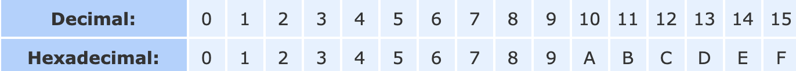

# Maps, primitives, File I/O

## [Java OO Tutorial](https://docs.oracle.com/javase/tutorial/java/concepts/) & [Java Classes](https://docs.oracle.com/javase/tutorial/java/javaOO/classes.html)

> "What possible states can this object be in?" and "What possible behavior can this object perform?"

### Object

- Object: An object is a software bundle of related state and behavior.
- Software objects are often used to model the real-world objects that you find in everyday life.
- Objects have **STATE** and **BEHAVIOR**
  - i.e Dog: State: Furry, 4 legs, snout Behavior: Barks, wags tail
- Software objects are conceptually similar to real-world objects: they too consist of state and related behavior
- **Data Encapsulation:** Handling state through the objects methods
- Ultimately, object remains in control of how the outside world is allowed to use it

### Benefits of Objects

1. Modularity
2. Information Hiding
3. Code re-use
4. Pluggability and debugging ease

### Class

- Class: A class is a blueprint or prototype from which objects are created.
- In the real world, you'll often find many individual objects all of the same kind
  - Many cars in the world, all of the same model
  - Each built from the same blueprints therefore, contain the same components
  > *instance* of the *class* of *objects*

```java
class Bicycle {

    int cadence = 0;
    int speed = 0;
    int gear = 1;

    void changeCadence(int newValue) {
         cadence = newValue;
    }

    void changeGear(int newValue) {
         gear = newValue;
    }

    void speedUp(int increment) {
         speed = speed + increment;   
    }

    void applyBrakes(int decrement) {
         speed = speed - decrement;
    }

    void printStates() {
         System.out.println("cadence:" +
             cadence + " speed:" + 
             speed + " gear:" + gear);
    }
}
```

- Blueprint for bicycles that might be used in an application

### Using the Bicycle object

```java
class BicycleDemo {
    public static void main(String[] args) {

        // Create two different 
        // Bicycle objects
        Bicycle bike1 = new Bicycle();
        Bicycle bike2 = new Bicycle();

        // Invoke methods on 
        // those objects
        bike1.changeCadence(50);
        bike1.speedUp(10);
        bike1.changeGear(2);
        bike1.printStates();

        bike2.changeCadence(50);
        bike2.speedUp(10);
        bike2.changeGear(2);
        bike2.changeCadence(40);
        bike2.speedUp(10);
        bike2.changeGear(3);
        bike2.printStates();
    }
}
```

## Inheritance

- Inheritance: Classes inherit state and behavior from their superclasses

## Interface

- Interface: contract between a class and the outside world. 
  - When a class implements an interface, it promises to provide the behavior published by that interface.

## Package

- Package: A namespace for organizing classes and interfaces in a logical manner.
  - Makes project easier to manage
  - Application Programming Interface (API)

## [Binary, Decimal and Hexadecimal Numbers](https://www.mathsisfun.com/binary-decimal-hexadecimal.html)

- Every digit in a decimal number has a position
- <= 10x Bigger
- 10x Smaller =>
- Decimal Number System (Base 10) because it is based on number 10 with 10 symbols 0-9

### Binary

> Binary Numbers are just "Base 2" instead of "Base 10". So you start counting at 0, then 1, then you run out of digits ... so you start back at 0 again, but increase the number on the left by 1


### Hexadecimal

- They look the same as the decimal numbers up to 9, but then there are the letters ("A',"B","C","D","E","F") in place of the decimal numbers 10 to 15.

