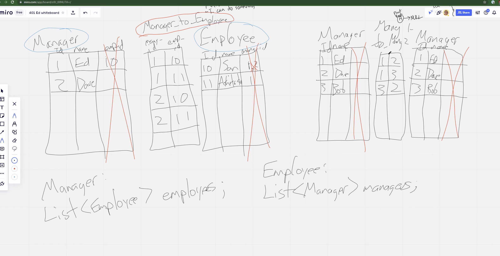
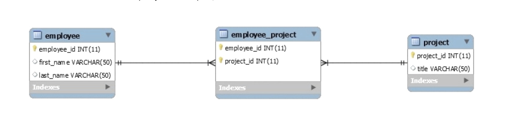
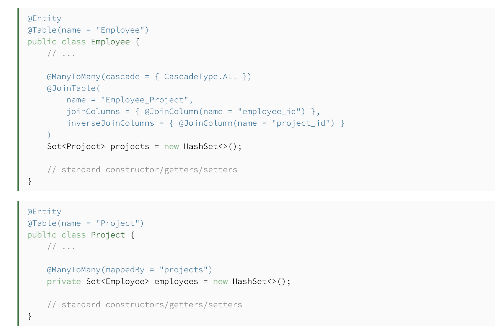

# Web App Security

## Security

- Security is an important if not the most important implementation that a Company can invest on

## Many to Many

- Luckily we have hibernate to handle the SQL that goes on behind the scenes
- However, hibernate and JPA can only do so much.
  - You need to get in there manually and handle specific things that you want
- Need a 'Join Table'

- Example of a model class

## References

- [Many to Many](https://www.baeldung.com/hibernate-many-to-many)
- [Security: A humorous overview](https://scholar.harvard.edu/files/mickens/files/thisworldofours.pdf)
