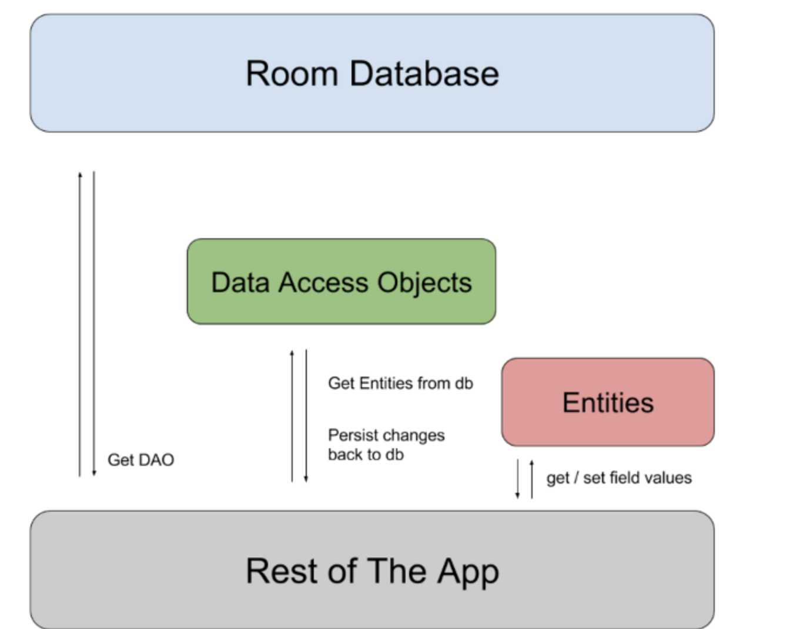

# Room

## Saving data in rooms

- You can save data in a **LOCAL DATABASE** by using a **Room**
- Common use cases is to cache relevant pieces of data
  - This allows the user to continue to browse content while they are offline

- 3 major components in Room
  1. Database class
  2. Data entities
  3. DAOs Data access objects

## Relationships between objects

- Two possible approaches
  1. Model relationship using intermediate data class with embedded objects
  2. Relational query method with a multimap return type

- Intermediate Approach
  - Allows you to avoid writing complex SQL queries
  - Can also  result in increased code complexity due to additional classes it requires

- Multimap
  - Requires more SQL queries

## Accessing Data using Room DAOs

- You can interact with  stored data by defining DAOs while using Room persistence library to store app's data
- DAOs access your apps database
- Two types of DAO methods that define database interaction
  1. Convenience m ethods that let you insert, update, and delete rows in database without writing SQL code
  2. Query methods where you write your own SQL query to interact with the DB

## References

- [Overview: Saving data with Room](https://developer.android.com/training/data-storage/room)

- [Defining entities in Room](https://developer.android.com/training/data-storage/room/defining-data)

- [Related entities in Room](https://developer.android.com/training/data-storage/room/relationships)

- [Accessing data with Room](https://developer.android.com/training/data-storage/room/accessing-data#java)